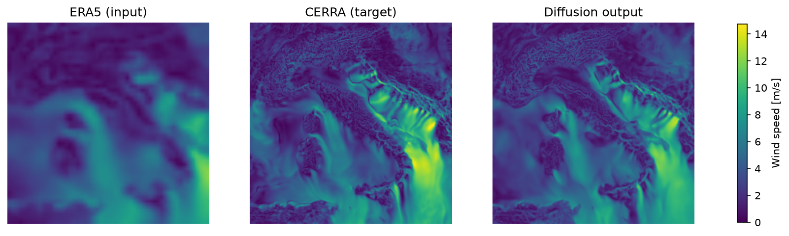

# ERA5-to-CERRA-Via-Diffusion-Models
This repository is a PyTorch implementation of the paper [Wind speed super-resolution and validation: from ERA5 to CERRA via diffusion models](https://link.springer.com/article/10.1007/s00521-024-10139-9) by Merizzi et al. 

The original repository of the paper can be found [here](https://github.com/fmerizzi/ERA5-to-CERRA-via-Diffusion-Models/).

## Getting started 
To get started with the project, first there's the need to install the necessary libraries. 

### 1. Clone the Repository
First, clone this repository in your local machine:

```bash
git clone https://github.com/MaxRondelli/ERA5-to-CERRA-via-diffusion-models.git
```

### 2. Install the necessary packages
It is recommeneded to create a conda environment in which install the necessary packages.
```bash
conda create -n <env_name> python=3.12
conda activate <env_name> 
pip install -r requirements.txt
```

### 3. Download the data
The project requires data from ERA5 and CERRA. They can be easily downloaded using the two python scripts in the `data` folder. Both rely on the `cdsapi` package, so make sure you have a `~/.cdsapirc` file configured with your [Copernicus Climate Data Store](https://cds.climate.copernicus.eu/) API key before running them.
- `download_era5.py`: downloads ERA5 10 m wind components (u10, v10) over the Italy/Mediterranean region, from 2009 to 2020.
- `download_cerra.py`: downloads CERRA 10 m wind speed (si10) over the same period, from 2009 to 2020.

```bash
python data/download_era5.py 
python data/download_cerra.py 
```

By default both scripts write to `data/era5` and `data/cerra` and download the full 2009-2020 range.

### 4. Preprocess the data
Raw NetCDF files need to be cropped, aligned on common timestamps and converted to numpy memmaps before training. `data/build_memmap.py` takes care of this:
- Crops CERRA to a 256x256 patch centered on Italy.
- Crops ERA5 to a lat/lon bounding box covering the same area and computes wind speed from u10/v10.
- Aligns both datasets on their common UTC timestamps.
- Splits the data into train (2010-2019), validation (2009) and test (2020) sets.

```bash
python data/build_memmap.py --cerra_dir data/cerra --era5_dir data/era5 --out_dir data/processed
```

`data/checks.py` is run automatically at dataset-loading time to verify that CERRA and ERA5 are correctly oriented and time-aligned; it raises an `AssertionError` if the memmaps look flipped or mismatched.

## Model
The model is a DDIM diffusion model conditioned on ERA5 that learns to generate the corresponding high-resolution CERRA wind speed field. Its main components are:
- `denoising_unet.py`: the denoising U-Net (depthwise-separable residual blocks, sinusoidal noise embedding, a CBAM channel + spatial attention bottleneck, and skip connections).
- `diffusion_model.py`: the `DiffusionModel` wrapper handling normalisation, the training step (velocity prediction) and DDIM-based reverse diffusion / sampling.
- `schedule.py`: the noise schedule used to mix signal and noise at each diffusion step (cosine schedule by default).
- `generators.py`: PyTorch `Dataset`/`DataLoader` classes that read the preprocessed memmaps, upscale ERA5 to the CERRA resolution and normalise both to `[0, 1]`.
- `setup.py`: central configuration file with dataset statistics, spatial/temporal dimensions, architecture widths and training hyperparameters.

## Training
Once the data has been preprocessed, train the model with:

```bash
python train.py --epochs 200 --batch_size 32 --device cuda
```

A checkpoint is saved to `checkpoints/` every 10 epochs, containing the network, EMA network, optimizer state and normalisation statistics. Training can be resumed from any checkpoint:

```bash
python train.py --resume checkpoints/epoch_050.pt
```

Run `python train.py --help` to see all the available options (data/checkpoint directories, learning rate, weight decay, steps per epoch, ...).

## Evaluation
Evaluate a trained checkpoint on the validation or test split with `evaluate.py`. It reports SSIM and PSNR against the CERRA ground truth and, optionally, saves a side-by-side comparison figure (ERA5 input, CERRA target, diffusion output):

```bash
python evaluate.py --checkpoint checkpoints/epoch_200.pt --split test --diffusion_steps 20 --n_samples 200
```
